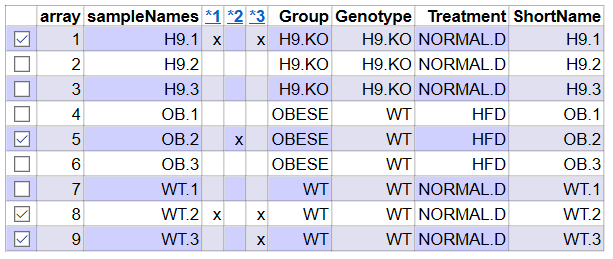
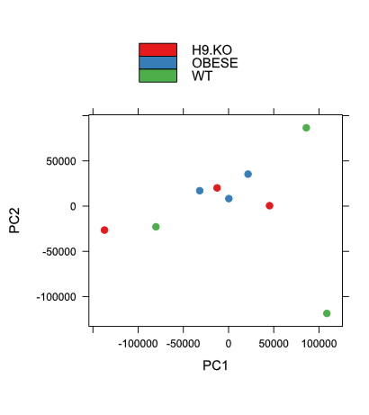
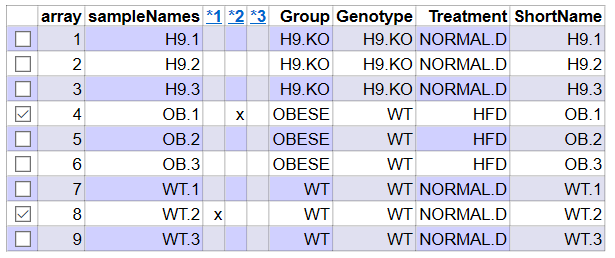
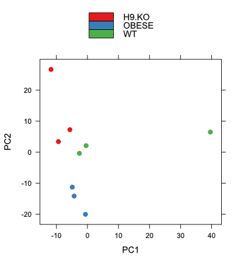
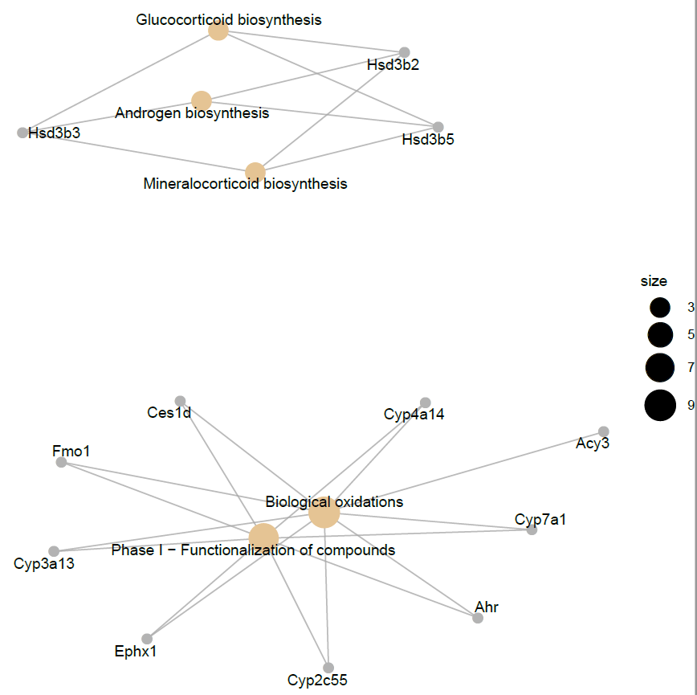
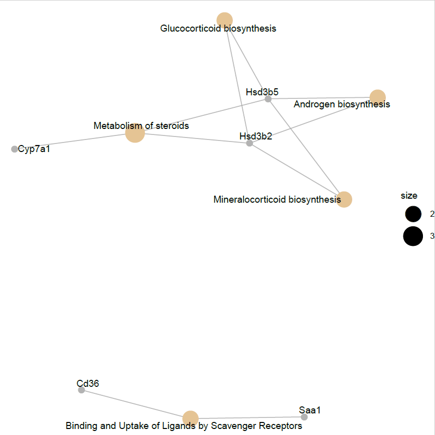

```{r setup, include=FALSE}
knitr::opts_chunk$set(echo = TRUE)
```


El enlace a todos los archivos necesarios para reproducir este documento se encuentran subidos en [este repositorio de GitHub](https://github.com/andressanchezr4/SANCHEZ_ANDRES_ADO_PEC1/tree/master/pec1omicos)


# 1. Abstract
El siguiente estudio pretende evaluar como afecta el rol de 2 HDAC, "Histone Deacetilase", (cuya función está vinculada con la progresión del ciclo celular) a las células del hígado. Se emplea un total de 12 ratones C57BL/6 divididos equitativamente en 4 grupos: uno de ellos tiene la proteína HDAC9 del hígado silenciada, otro la HDAC6 para el mismo órgano, mientras que los 2 grupos restantes son WT. Todos los grupos son alimentados con una dieta normal a excepción de uno de los WT, al cual se le da una dieta alta en grasas. Dado que este estudio necesitaría un total de 4 comparaciones (cada grupo KO vs OBESE&NORMAL) con el fin de simplificarlo hemos eliminado el grupo H6KO del análisis. 


# 2. Objetivos
El objetivo es observar como afecta el Knock-out de la protéina HDAC9 a la expresión génica de las células del hígado de los ratones C57BL/6. 


# 3. Materiales y métodos
```{r, include = FALSE}
setwd("C:/Users/asus/Desktop/pec1omicos")
dir.create("C:/Users/asus/Desktop/pec1omicos/data")
dir.create("C:/Users/asus/Desktop/pec1omicos/results")
```

El siguiente análisis se trata de un estudio observacional ya que tan solo busca describir como cambia la expresión génica de las células del hígado en 3 grupos de ratones C57BL/6. De estos 3, uno tiene un KO para el gen HDAC9 (H9KO) mientras que el resto son WT (OBESE y NORMAL). Los grupos WT son alimentados con distintas dietas (Alta en grasas y dieta normal), siendo el grupo KO alimentado con una dieta normal. En el procesado de estos datos se han utilizado chips de un solo color cuyo nombre comercial es GeneChip™ Mouse Genome 430 2.0 Array. El diseño experimental de este estudio consta de 1 factor y 1 bloque:
-Factor: dieta, la cual consta de dos niveles, dieta alta en grasas y dieta normal. 
-Bloque: background genético, el cual consta de dos niveles, KO y WT.

En lo referente al workflow se ha seguido el esquema propuesto en Case_Study_1-Microarray_Analysis. 


### 3.1 Preparación de los datos para el análisis

En primer lugar accedemos a la [dirección de GEO](https://www.ncbi.nlm.nih.gov/geo/query/acc.cgi?acc=GSE120797) donde descargamos todos los archivos comprimidos para posteriormente descomprimirlos en la carpeta data. Una vez tenemos todos los archivos CEL generamos el archivo csv "targets", en el cual reflejamos la informácion especifica de cada grupo y muestra: 

+ Filename: Nombre de la muestra CEL.
+ Group: Grupo de la muestra. 
+ Genotype: Genotipo de la muestra.
+ Treatment: Dieta seguida. 
+ ShortName: Nombre simplificado de cada muestra. 
```{r, include = FALSE}
targets1 <- read.csv2("./data/targets.csv", header = TRUE, sep = ";") 
```

A continuación sustituimos el nombre de nuestras muestras por aquellos que se encuentran contenidos en el archivo targets.csv, concretamente en la columna ShortName.
```{r, include = FALSE}
library(oligo)
library(Biobase)
celFiles1 <- list.celfiles("./data", full.names = TRUE)
my.targets1 <-read.AnnotatedDataFrame(file.path("./data","targets.csv"), header = TRUE, row.names = 1, sep=";") 
rawData1 <- read.celfiles(celFiles1, phenoData = my.targets1)

my.targets1@data$ShortName->rownames(pData(rawData1))
colnames(rawData1) <-rownames(pData(rawData1)) 
```


### 3.2 Control de calidad

Una vez cargados los datos crudos debemos realizar un control de calidad que nos asegure que vamos a poder llevar a cabo correctamente el análisis. Para ello utilizamos el paquete arrayQualityMetrics.
```{r, include = FALSE}
library(arrayQualityMetrics)
arrayQualityMetrics(rawData1, outdir = "./qualitymetrics", force = TRUE, intgroup = "Group")
```


### 3.3 Normalización y segundo control de calidad

Para llevar a cabo este paso utilizamos el método de normalización RMA (Robust Multichip Analysis).
```{r, include = FALSE}
eset_rma1 <- rma(rawData1)
```

Una vez completado realizamos nuevamente un control de calidad con los datos ya normalizados. 
```{r, include = FALSE}
arrayQualityMetrics(eset_rma1, outdir = file.path("./segundoqualitymetrics", "QCDir.Norm"), force=TRUE, intgroup = "Group")
```


### 3.4 Filtraje no específico

Filtramos aquellos que genes que o bien no tengan variación significativa o bien estén anotados defectuosamente. Para ello utilizamos la funcion nsFilter del paquete genefilter. Guardamos los filtrados en la variable eset_filtered1 y exportamos tanto los genes normalizados como los filtrados a un archivo .csv.
```{r, include = FALSE}
library(genefilter)
library(mouse4302.db)
annotation(eset_rma1) <- "mouse4302.db"
filtered1 <- nsFilter(eset_rma1, 
                     require.entrez = TRUE, remove.dupEntrez = TRUE,
                     var.filter=TRUE, var.func=IQR, var.cutoff=0.75, 
                     filterByQuantile=TRUE, feature.exclude = "^AFFX")
```

```{r, include = FALSE}
eset_filtered1 <-filtered1$eset
```

```{r, include = FALSE}
write.csv(exprs(eset_rma1), file="./normalized.Data.csv")
write.csv(exprs(eset_filtered1), file="./normalized.Filtered.Data.csv")
```


### 3.5 Identificación de genes diferencialmente expresados 

Comparamos la expresión génica de cada grupo con el resto. Para ello generamos una gráfica donde se podrá observar la variabilidad de todos los genes del estudio. Seleccionaremos como diferencialmente expresados aquellos cuyas desviaciones estándard sea mayor entre grupos, situando el threshold en el percentil 90-95.


### 3.6 Selección de genes diferencialmente expresados   

Construimos un modelo lineal mediante el cual se seleccinorán los genes que se encuentren diferencialmente expresados. Se utilizará el paquete lima. 


### 3.7 Matriz de diseño + Matriz de contrastes

Generamos la matriz de diseño con los genes filtrados así como su matriz de contrastes correspondiente. 
```{r, message=FALSE, warning = FALSE, echo= FALSE}
library(limma)
designMat1<- model.matrix(~0+Group, pData(eset_filtered1))
colnames(designMat1) <- c("H9KO", "OBESE", "WT")
row.names(designMat1) <- c("H9.1", "H9.2", "H9.3", "OB.1", "OB.2", "0B.3", "WT.1", "WT.2", "WT.3")
print(designMat1)
```

En la matriz de contrastes se proponen las comparaciones: 
+ H9KOvsOBESE: ¿Existen diferencias entre la expresión génica de los KO y los ratones obesos?
+ H9KOvsWT: ¿Existen diferencias entre la expresion genica de los KO y los ratones WT?
+ INT: ¿Existen diferencias en la expresion génica entre los grupos anteriores?  

Planteando estos contrastes podremos averiguar si verdaderamente existe algun tipo de influencia en la firma genética por parte del gen HDAC9.
```{r, echo=FALSE}
cont.matrix1 <- makeContrasts (H9KOvsOBESE = H9KO-OBESE,
                              H9KOvsWT = H9KO-WT,
                              INT = (H9KO-OBESE) - (H9KO-WT),
                              levels=designMat1)
print(cont.matrix1)
```

### 3.8 Estimación del modelo y selección de genes

Estimamos los modelos, así como planteamos las comparaciones y las de pruebas de significación. Utilizamos el paquete limma, el cual emplea modelos empíricos de Bayes.
```{r, include = FALSE}
library(limma)
fit1<-lmFit(eset_filtered1, designMat1)
fit.main1<-contrasts.fit(fit1, cont.matrix1)
fit.main1<-eBayes(fit.main1)
```

Deseamos realizar 3 comparaciones: 
+ Comparación 1: Genes con cambios en su expresión entre los KO y los obesos. 
+ Comparación 2: Genes con cambios en su expresión entre los KO y los WT.
+ Comparación 3: Genes con cambios en su expresión en ambos grupos. 
```{r, include = FALSE}
topTab_H9KOvsOBESE <- topTable (fit.main1, number=nrow(fit.main1), coef="H9KOvsOBESE", adjust="fdr")
topTab_H9KOvsWT<- topTable (fit.main1, number=nrow(fit.main1), coef="H9KOvsWT", adjust="fdr") 
topTab_INT<- topTable (fit.main1, number=nrow(fit.main1), coef="INT", adjust="fdr") 
```


### 3.9 Anotación de los resultados   

Guardamos todos los genes cuya expresión ha sido significativa debidamente identificados mediante la función annotatedTopTable. 
```{r, include = FALSE, message=FALSE, warning=FALSE}
annotatedTopTable <- function(topTab, anotPackage)
{
  topTab <- cbind(PROBEID=rownames(topTab), topTab)
  myProbes <- rownames(topTab)
  thePackage <- eval(parse(text = anotPackage))
  geneAnots <- select(thePackage, myProbes, c("SYMBOL", "ENTREZID", "GENENAME"))
  annotatedTopTab<- merge(x=geneAnots, y=topTab, by.x="PROBEID", by.y="PROBEID")
return(annotatedTopTab)
}
```

```{r, include = FALSE, message=FALSE, warning=FALSE}
topAnnotated_H9KOvsOBESE <- annotatedTopTable(topTab_H9KOvsOBESE, anotPackage="mouse4302.db")
topAnnotated_H9KOvsWT <- annotatedTopTable(topTab_H9KOvsWT, anotPackage="mouse4302.db")
topAnnotated_INT <- annotatedTopTable(topTab_INT, anotPackage="mouse4302.db")

write.csv(topAnnotated_H9KOvsOBESE, file="./results/topAnnotated_H9KOvsOBESE.csv")
write.csv(topAnnotated_H9KOvsWT, file="./results/topAnnotated_H9KOvsWT.csv")
write.csv(topAnnotated_INT, file="./results/topAnnotated_INT.csv")
```


### 3.10 Comparaciones multiples 

Determinamos el número de genes que se están "down-regulated" o "up-regulated" (o sin diferencias significativas) en cada comparación. 
```{r, include =FALSE}
library(limma)
res1<-decideTests(fit.main1, method="separate", adjust.method="fdr", p.value=0.1, lfc=1)
sum.res.rows1<-apply(abs(res1),1,sum)
res.selected1<-res1[sum.res.rows1!=0,] 
```


### 3.11 Análisis de significación biológica 

Utilizamos el paquete ReactomePA para determinar el contexto biológico de los genes que han tenido significación. Este parte lleva a cabo una selección poco restrictiva con el fin de que sea posible tener un número suficiente de éstos. Utilizamos como anotación 'universe' ya que ésta tiene en cuenta todos los genes que puedan estar presentes en la base de datos Gene Ontology.
```{r, include =FALSE}
listOfTables1 <- list(H9KOvsOBESE = topTab_H9KOvsOBESE,
                     H9KOvsWT = topTab_H9KOvsWT,
                     INT = topTab_INT)
listOfSelected1 <- list()
for (i in 1:length(listOfTables1)){
  # select the toptable
  topTab <- listOfTables1[[i]]
  # select the genes to be included in the analysis
  whichGenes<-topTab["adj.P.Val"]<0.15
  selectedIDs <- rownames(topTab)[whichGenes]
  # convert the ID to Entrez
  EntrezIDs<- select(mouse4302.db, selectedIDs, c("ENTREZID"))
  EntrezIDs <- EntrezIDs$ENTREZID
  listOfSelected1[[i]] <- EntrezIDs
  names(listOfSelected1)[i] <- names(listOfTables1)[i]
}
sapply(listOfSelected1, length)
```

```{r, include =FALSE}
mapped_genes2GO1 <- mappedkeys(org.Mm.egGO)
mapped_genes2KEGG1 <- mappedkeys(org.Mm.egPATH)
mapped_genes1 <- union(mapped_genes2GO1 , mapped_genes2KEGG1)
```

```{r, message=FALSE, include =FALSE}
library(ReactomePA)

listOfData1 <- listOfSelected1[1:2]
comparisonsNames1 <- names(listOfData1)
universe <- mapped_genes1

for (i in 1:length(listOfData1)){
  genesIn <- listOfData1[[i]]
  comparison <- comparisonsNames1[i]
  enrich.result <- enrichPathway(gene = genesIn,
                                 pvalueCutoff = 0.05,
                                 readable = T,
                                 pAdjustMethod = "BH",
                                 organism = "mouse",
                                 universe = universe)
  
  cat("##################################")
  cat("\nComparison: ", comparison,"\n")
  print(head(enrich.result))

  if (length(rownames(enrich.result@result)) != 0) {
  write.csv(as.data.frame(enrich.result), 
             file =paste0("./results/","ReactomePA.Results.",comparison,".csv"), 
             row.names = FALSE)
  
  pdf(file=paste0("./results/","ReactomePABarplot.",comparison,".pdf"))
    print(barplot(enrich.result, showCategory = 15, font.size = 4, 
            title = paste0("Reactome Pathway Analysis for ", comparison,". Barplot")))
  dev.off()
  
  pdf(file = paste0("./results/","ReactomePAcnetplot.",comparison,".pdf"))
    print(cnetplot(enrich.result, categorySize = "geneNum", schowCategory = 15, 
         vertex.label.cex = 0.75))
  dev.off()
  }
}
```


# 4. Resultados

### 4.1 Controles de calidad

**4.1.1 Control de calidad datos crudos**

Como puede observase las muestras H9.1 y WT.2 presentan outliers tanto en las distancias entre arrays como en los MA plots, lo cual nos sugiere que posiblemente estas muestras sean defectuosas. 
```{r fig.cap="FIGURA 1. Control de calidad de los datos crudos", echo=FALSE}

```

En un gráfica PCA ideal deberíamos poder observar cada grupo como una concentración de las muestras entorno a un área más o menos definida. En este caso podemos ver que a excepción del grupo OBESE, los otros dos (sobre todo WT) presentan diferencias notables entre sí. En el caso de los H9.KO, posiblemente la muestra más alejada se trate de un outlier, lo cual nos sugeriría que la expresion génica de OBESE y H9KO es parecida.  
```{r fig.cap="FIGURA 2. PCA datos crudos", echo=FALSE}

```

En una gráfica Distance Between Arrays ideal deberíamos observar como todas las muestras de un mismo grupo se encuentran formando bloques de un solo color. En este caso podemos ver que las muestras WT se encuentran especialmente dispersas. 
```{r fig.cap="FIGURA 3. DBA datos crudos", echo=FALSE}
knitr::include_graphics("qualitymetrics/hm.PNG")
```

En una gráfica Boxplot ideal debería observarse como el tamaño de las cajas es muy parecido. En este caso se ha detectado un outlier para la muestra OB.2. 
```{r fig.cap="FIGURA 4. Boxplot datos crudos", echo=FALSE}
knitr::include_graphics("qualitymetrics/box.PNG")
```

**4.1.2 Control de calidad datos normalizados**

A pesar de haber tenido algunas muestras sospechosomanente defectuosas seguimos adelante con el estudio y después de haber podido llevar a cabo la normalización sin problemas obtenemos que la calidad de los datos aumenta. 
```{r fig.cap="FIGURA 5. Control de calidad datos normalizados", echo=FALSE}

```

Podemos ver que existe cierta mejora en la agrupación de las muestras para este tipo de gráficos, mientras que la muestra WT.2 sigue siendo un outlier. 
```{r fig.cap="FIGURA 6. DBA datos normalizados", echo=FALSE}
knitr::include_graphics("segundoqualitymetrics/QCDir.Norm/hm.PNG")
```

Donde si observamos una mejora notable es en los gráficos PCA ya que después de la normalización si que es posible definir áreas donde quedan delimitados las muestras de cada grupo.
```{r fig.cap="FIGURA 7. PCA datos normalizados", echo=FALSE}

```

También observamos como mejora la calidad de los boxplot ya que el tamaño de las cajas de todas las muestras se iguala (a pesar del outlier  OB.1). 
```{r fig.cap="FIGURA 8. Boxplot datos normalizados", echo=FALSE}
knitr::include_graphics("segundoqualitymetrics/QCDir.Norm/box.PNG")
```


### 4.2 Genes diferencialmente expresados

**4.2.1 Genes que presentan una mayor diferencia de desviaciones estandard**

Observamos que de los 22690 analizados, 2269 se encuentran en el percentil 90 mientras que 1135 se encuentran en el percentil 95. 
```{r, fig.cap="FIGURA 9. Gráfico variabilidad de genes según desviación típica", echo= FALSE}
sds <- apply(exprs(eset_rma1), 1, sd)
sds0 <- sort(sds)
plot(1:length(sds0), sds0, main = "Variabilidad de los genes", sub = "Las líneas verticales señalan los percentiles del 90% y 95%", xlab = "Índice de genes (de menor a mayor variabilidad)", ylab = "Desviación estándar")
abline(v = length(sds) * c(0.9, 0.95))
```


**4.2.2 Gráficos volcán**

Generamos los gráficos de volcan para cada contraste. Podemos observar que los genes diferencialmente expresados se encuentran en la parte superior y separados del centro. Cuánto más acentuadas sean éstas características mayor será la significancia estadística de dicho gen.
```{r,fig.cap="FIGURA 10. Gráficos volcano", message= FALSE, echo=FALSE}
geneSymbols <- AnnotationDbi::select(mouse4302.db, rownames(fit.main1), c("SYMBOL"))
SYMBOLS<- geneSymbols$SYMBOL

par(mfrow=c(2,2))
volcanoplot(fit.main1, coef=1, highlight=4, names=SYMBOLS, main=paste("Genes diferencialmente expresados en", colnames(cont.matrix1)[1], sep="\n"))
abline(v=c(-1,1))

volcanoplot(fit.main1, coef=2, highlight=4, names=SYMBOLS, main=paste("Genes diferencialmente expresados en", colnames(cont.matrix1)[2], sep="\n"))
abline(v=c(-1,1))

volcanoplot(fit.main1, coef=3, highlight=4, names=SYMBOLS, main=paste("Genes diferencialmente expresados en", colnames(cont.matrix1)[3], sep="\n"))
abline(v=c(-1,1))
```

**4.2.3 Heatmap**

Creamos los heatmaps a partir de los genes que han estado diferenciamente expresados en al menos una comparación. Las zonas en rojo se corresponden a genes sobreexpresados mientras que las zonas más azules a los genes cuya expresión es más baja.
```{r, include=FALSE}
probesInHeatmap <- rownames(res.selected1)
HMdata <- exprs(eset_filtered1)[rownames(exprs(eset_filtered1)) %in% probesInHeatmap,]

geneSymbols <- select(mouse4302.db, rownames(HMdata), c("SYMBOL"))
SYMBOLS<- geneSymbols$SYMBOL
rownames(HMdata) <- SYMBOLS
write.csv(HMdata, file = file.path("./results/data4Heatmap.csv"))
```

```{r, message= FALSE, warning= FALSE, fig.cap="FIGURA 11. Heatmap", echo=FALSE}
library(gplots)
my_palette <- colorRampPalette(c("blue", "red"))(n = 299)
heatmap.2(HMdata,
         Rowv = TRUE,
         Colv = TRUE,
         dendrogram = "both",
         main = "Genes diferencialmente expresados \n (FDR < 0,1, logFC >=1)",
         scale = "row",
         col = my_palette,
         sepcolor = "white",
         sepwidth = c(0.05,0.05),
         cexRow = 0.5,
         cexCol = 0.9,
         key = TRUE,
         keysize = 1.5,
         density.info = "histogram",
         ColSideColors = c(rep("red",3),rep("blue",3), rep("green",3)),
         tracecol = NULL,
         srtCol = 30)
```

**4.2.4 Resumen del análisis de genes diferencialmente expresados** 

Viendo el resumen de los genes seleccionados de cada comparación podemos ver cuáles se encuentran sobreexpresados (Up), cuáles downregulated (Down) y aquellos que no tienen significacia estadística (NotSig).
```{r, fig.cap = "FIGURA 12. Resumen de los genes diferencialmente expresados", echo = FALSE}
print(summary(res.selected1))
```

Podemos observar de manera gráfica el número de genes que se encuentran alterados para cada grupo, así como aquellos comunes entre los mismos. 
```{r, fig.cap="FIGURA 13. Venn Diagram", echo=FALSE}
vennDiagram (res.selected1[,1:3], cex = 0.9)
```


### 4.3 Significación biológica

Para obtener los resultados de significación biológica hemos establecido un nivel de significación del 5%. Mostramos a continuación las 5 primeras rutas que se encuentran estadísitcamente más alteradas de cada comparación. Para los INT ninguna de las rutas presenta un p-valor por debajo de 0,05 y por ello no podemos incluirlo en este paso. 
```{r, echo=FALSE}
Tab.react_H9KOvsOBESE <- read.csv2(file.path("./results/ReactomePA.Results.H9KOvsOBESE.csv"), 
                       sep = ",", header = TRUE, row.names = 1)
Tab.react_H9KOvsWT <- read.csv2(file.path("./results/ReactomePA.Results.H9KOvsWT.csv"), 
                       sep = ",", header = TRUE, row.names = 1)


Tab.react_H9KOvsOBESE <- Tab.react_H9KOvsOBESE[1:4, 1:5]
Tab.react_H9KOvsWT <- Tab.react_H9KOvsWT[1:4, 1:5]


knitr::kable(Tab.react_H9KOvsOBESE, booktabs = TRUE, caption = "Rutas biológicas significativas en H9KOvsOBESE") 
knitr::kable(Tab.react_H9KOvsWT, booktabs = TRUE, caption = "Rutas biológicas significativas en H9KOvsWT")
```

Una forma gráfica de observar estos resultados es mediante un cnetplot. A continuación se muestra el cnetplot para la comparación H9KOvsOBESE
```{r, fig.cap="FIGURA 13. CNETPLOT H9KOvsOBESE", echo=FALSE}

```

Y el correspondiente para la comparación H9KOvsWT.
```{r, fig.cap="FIGURA 14. CNETPLOT H9KOvsWT", echo=FALSE}

```

### 4.4 Archivos generados

A continuación se muestra una lista de los archivos que han sido generados durante este análisis. 
```{r, echo=FALSE}
listOfFiles <- dir("./results/") 
knitr::kable(
  listOfFiles, booktabs = TRUE,
  caption = 'List of files generated in the analysis',
  col.names="List_of_Files"
)
```

# 5. Discusión

Al margen de los resultados obtenidos, es necesario comentar que el número de muestras para este estudio debería ser mayor. Además del bajo número de muestras y su alta variabilidad (especialemente para el grupo WT), se añaden los problemas encontrados durante el control de calidad, probablemente también relacionados con esta alta variabilidad. 

En caso de querer seguir estudiando el rol de la HDAC9 en el hígado de los ratones C57BL/6, el primer paso que debería llevarse a cabo sería aumentar la n para cada grupo, de forma que se pueda determinar que muestras son outliers con mayor fiabilidad. De momento no se puede afirmar que los resultados obtenidos sean representativos. 

# 6. Conclusión

Podríamos concluir que, aunque este estudio puede estar sugieriendo ciertas vias metabólicas/genes que verdaderamente pueden verse afectados por la supresion de la HDAC9, aún es necesario un número de muestras mayor para poder poder obtener resultados más fiables. 


# 7. Referencias

[Liver RNA microarray from female HDAC6–/–, HDAC9–/– mice, 	Beier UH, Akimova T, Han R, Wang L, Hancock WW, Oct 04, 2018](https://www.ncbi.nlm.nih.gov/geo/query/acc.cgi?acc=GSE120797)


